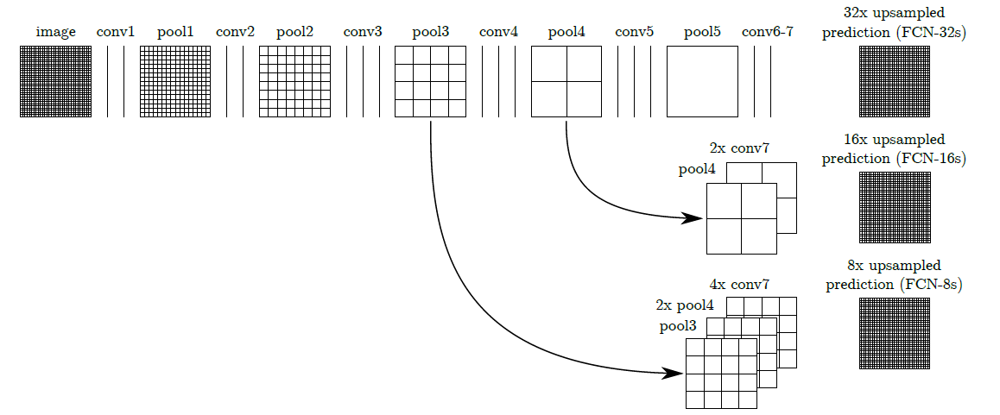

# Semantic Segmentation
### Introduction
In this project, our goal is to label the pixels of a road in images using a Fully Convolutional Network (FCN).

### Implementation

#### 0. FCN architecture used in the project
Stucturally, an FCN is usually comprised of two parts: encoder and decoder. The encoder is a series of convolutional layers like VGG and
ResNet. For this project, we use the pretrained VGG16 model. The goal of the encoder is to extract features from the image, the decoder upscales the output of the encoder such that it's the same size as the original image. Thus, it can result in segmentation or prediction
of each individual pixel in the original image.

FCNs take advantages of three special techniques:
* Firstly, replace fully connected layers of CNNs with 1x1 convolutional layers. 
* Secondly, upsample through the usage of transposed convolutional layers; 
* Thirdly, use skip connections. These skip connections allow the network to use information from multiple resolution scales so that the   network is able to make more precise segmentation decisions. For this case, extrally use the the 4rd and the 3rd layer to perform the skip 
  connections.

The FCN implemented in the project is based on the paper [Fully Convolutional Networks for Semantic Segmentation](https://arxiv.org/abs/1605.06211).

From it, the FCN architecture used is shown as follows:


#### 1. Load the pre-trained vgg model

The function `load_vgg()` in `main.py` mainly load a pre-trained mode - [vgg16](https://s3-us-west-1.amazonaws.com/udacity-selfdrivingcar/vgg.zip). This is actually the encoder part of FCNs.

#### 2. 1x1 conv and deconvolution
Next, the function `layers()` in `main.py` realize what the core three special techniques as described above:
* Replace fully connected layer with 1x1 conv layer. After VGG layer 7, use 1x1 convolutions to continue;
* Upsample the 1x1 convs output, using transposed convolution or called deconvolution.
* Skip connections for twice(Because deconvolution, first should be from 4th layer of vgg, then the 3th layer)

#### 3. Optimize the FCN

In the function `optimize()` of `main.py`, the loss function is cross-entropy, and an Adam optimizer is used.

#### 4. Train

Hyper parameters used for training are as follows:
* keep_prob = 0.5
* learning_rate = 1e-4
* epochs = 20
* batch_size = 5

#### 5. Results


### Samples
I choose some samples from the result of the FCN. As can be seen, mostly the performance looks nice, most road districts are marked in
green reasonablely. But ofcource in small number of images, it seems that semantic segamentation(FCN) hasn't labeled some more precise pixels because of environmental influence such as shadow or sharp light.


------
Udacity original document

### Introduction
In this project, you'll label the pixels of a road in images using a Fully Convolutional Network (FCN).
### Setup
##### GPU
`main.py` will check to make sure you are using GPU - if you don't have a GPU on your system, you can use AWS or another cloud computing platform.
##### Frameworks and Packages
Make sure you have the following is installed:
 - [Python 3](https://www.python.org/)
 - [TensorFlow](https://www.tensorflow.org/)
 - [NumPy](http://www.numpy.org/)
 - [SciPy](https://www.scipy.org/)

You may also need [Python Image Library (PIL)](https://pillow.readthedocs.io/) for SciPy's `imresize` function.

##### Dataset
Download the [Kitti Road dataset](http://www.cvlibs.net/datasets/kitti/eval_road.php) from [here](http://www.cvlibs.net/download.php?file=data_road.zip).  Extract the dataset in the `data` folder.  This will create the folder `data_road` with all the training a test images.

### Start
##### Implement
Implement the code in the `main.py` module indicated by the "TODO" comments.
The comments indicated with "OPTIONAL" tag are not required to complete.
##### Run
Run the following command to run the project:
```
python main.py
```
**Note** If running this in Jupyter Notebook system messages, such as those regarding test status, may appear in the terminal rather than the notebook.

### Submission
1. Ensure you've passed all the unit tests.
2. Ensure you pass all points on [the rubric](https://review.udacity.com/#!/rubrics/989/view).
3. Submit the following in a zip file.
 - `helper.py`
 - `main.py`
 - `project_tests.py`
 - Newest inference images from `runs` folder  (**all images from the most recent run**)
 
### Tips
- The link for the frozen `VGG16` model is hardcoded into `helper.py`.  The model can be found [here](https://s3-us-west-1.amazonaws.com/udacity-selfdrivingcar/vgg.zip).
- The model is not vanilla `VGG16`, but a fully convolutional version, which already contains the 1x1 convolutions to replace the fully connected layers. Please see this [post](https://s3-us-west-1.amazonaws.com/udacity-selfdrivingcar/forum_archive/Semantic_Segmentation_advice.pdf) for more information.  A summary of additional points, follow. 
- The original FCN-8s was trained in stages. The authors later uploaded a version that was trained all at once to their GitHub repo.  The version in the GitHub repo has one important difference: The outputs of pooling layers 3 and 4 are scaled before they are fed into the 1x1 convolutions.  As a result, some students have found that the model learns much better with the scaling layers included. The model may not converge substantially faster, but may reach a higher IoU and accuracy. 
- When adding l2-regularization, setting a regularizer in the arguments of the `tf.layers` is not enough. Regularization loss terms must be manually added to your loss function. otherwise regularization is not implemented.

### Why Layer 3, 4 and 7?
In `main.py`, you'll notice that layers 3, 4 and 7 of VGG16 are utilized in creating skip layers for a fully convolutional network. The reasons for this are contained in the paper [Fully Convolutional Networks for Semantic Segmentation](https://arxiv.org/pdf/1605.06211.pdf).

In section 4.3, and further under header "Skip Architectures for Segmentation" and Figure 3, they note these provided for 8x, 16x and 32x upsampling, respectively. Using each of these in their FCN-8s was the most effective architecture they found. 

### Optional sections
Within `main.py`, there are a few optional sections you can also choose to implement, but are not required for the project.

1. Train and perform inference on the [Cityscapes Dataset](https://www.cityscapes-dataset.com/). Note that the `project_tests.py` is not currently set up to also unit test for this alternate dataset. Cityscapes is a much more extensive dataset, with segmentation of 30 different classes (compared to road vs. not road on KITTI) on either 5,000 finely annotated images or 20,000 coarsely annotated images.
2. Add image augmentation. You can use some of the augmentation techniques you may have used on Traffic Sign Classification or Behavioral Cloning, or look into additional methods for more robust training!
3. Apply the trained model to a video. This project only involves performing inference on a set of test images, but you can also try to utilize it on a full video.
 
### Using GitHub and Creating Effective READMEs
If you are unfamiliar with GitHub , Udacity has a brief [GitHub tutorial](http://blog.udacity.com/2015/06/a-beginners-git-github-tutorial.html) to get you started. Udacity also provides a more detailed free [course on git and GitHub](https://www.udacity.com/course/how-to-use-git-and-github--ud775).

To learn about REAMDE files and Markdown, Udacity provides a free [course on READMEs](https://www.udacity.com/courses/ud777), as well. 

GitHub also provides a [tutorial](https://guides.github.com/features/mastering-markdown/) about creating Markdown files.
